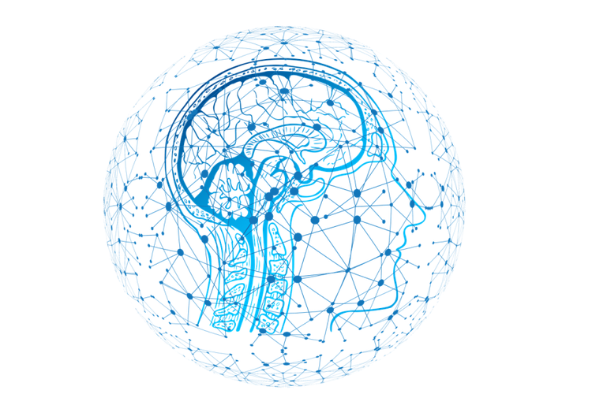

*Image Source - https://neurotracker.net/2018/10/25/is-neuroscience-the-future-of-sports-science/*

Artifical Intelligence is structured using Neural Networks "which loosely model the neurons in a biologcal brain." [1]

In this article, we explore ideas from multiple branches of science that aggregate into a  polymorphic theory of learning that can act as guide when learning something new to general problem solving.

This article is dedicated to 

### Resources

1. https://en.wikipedia.org/wiki/Artificial_neural_network